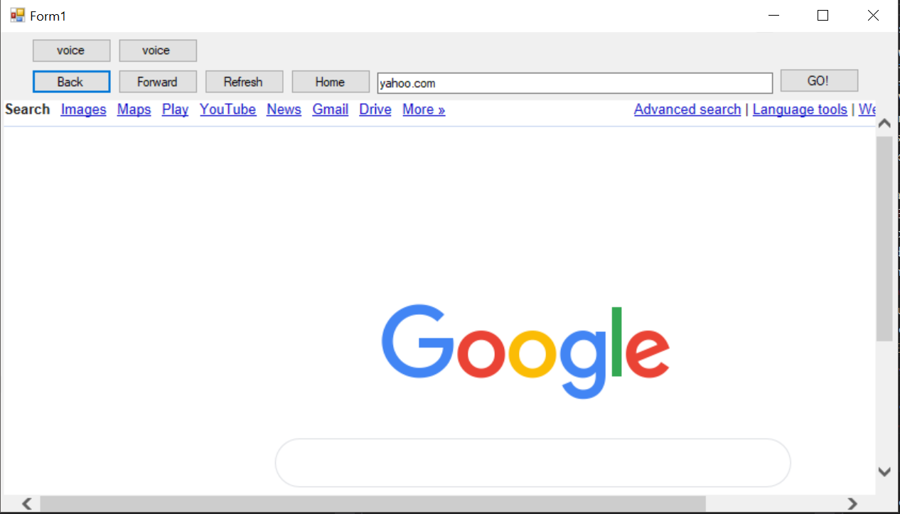

# voice-easy
A voice based web browser for people with disabilities/handicapped/visually impaired to gain access the internet and browse with relative ease.

<h3>What is Voice Easy ?</h3>

VoiceEasy is a software application capable of providing a swift and smooth experience of browsing the Internet. With the help of voice-to-text modules, we have efficiently provided a comfortable browsing experience for users that are unable to physically access the Web.

<h3>Requirements</h3>

- C# Compiler 
- Windows 7 or newer
- Microsoft Visual Studio
- Microphone 

<h3>Screenshots</h3>

- Home Page 

- Voice Enable (Use speech recognition) 

- Navigation (Using speech) 

<h3>Contributors</h3>

- Ashish Paul Kurian (17BCI0160)
- Sameer Shiraz (17BCI0162)
- Adithya S Anil (17BCI0163)
- Nived Sanil (17BCE2201)
- Supratim Sarkar (17BCE2203)
- Nigel John (17BCE2224)

<h3>Attribution</h3>

- MIT Open Source License [View License](https://opensource.org/licenses/MIT)

